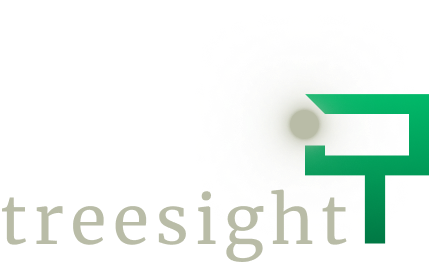

# Getting Started 

This is a basic NextJS 13 based application. It focuses on the `Targeted Experiences` use cases, and aligns to creating segments for enterprise users to receive a messaging component.


* Clone with git clone https://github.com/launchdarkly-labs/treesight-demo
* `cd treesight-demo`
* Create a `.env` in the root directory, put the following in `NEXT_PUBLIC_LD_CLIENT_KEY='<Your LaunchDarkly Client Key'`
* `npm i; npm run dev`

The application should launch on `https://localhost:3000` and be ready to go! 

Note: By default it uses a feature flag with a key of `messaging` to control the visibility of the component. The login is hard coded to use our test user, Calvin. The Context structure is as follows - 

```json
 context: {
      kind: "multi",
      user: {
        key: "0",
        name: "anonymous",
        priceLevel: 'freeTier'
      },
      device: {
        key: "0",
        operating_system: "MacOS",
        mobile_device: "False",
      },
    },
```